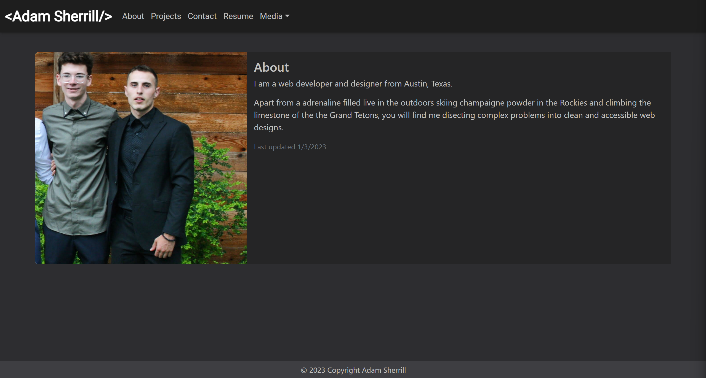

# React Portfolio

## Description

Here I have created my personal React based developer portfolio where employers and piers can check out my projects, resume, a bit about my self and a contact form.

Heroku App:
(https://asherrill.herokuapp.com/)



## Table of Contents

- [Installation](#installation)
- [Usage](#usage)
- [License](#license)
- [Badges](#Badges)
- [Questions](#Questions)

## Installation

To Install:

Clone the repository from GitHub (https://github.com/ajsherrill2/react-portfolio).

Run these command lines in your terminal to install necessary dependencies:

```
npm i
```

## Usage

Direct your terminal to the repository root directory and run this command line to initiate application:

```
npm run start
```

Direct your browser to "http://localhost:3000/" to view locally.

## License

This application is covered under the MIT license.

## Badges


## Questions

If you have any questions about the repo open an issue or contact me directly at adamsherrill2@gmail.com. You can find more of my work at [ajsherrill2](https://github.com/ajsherrill2/).